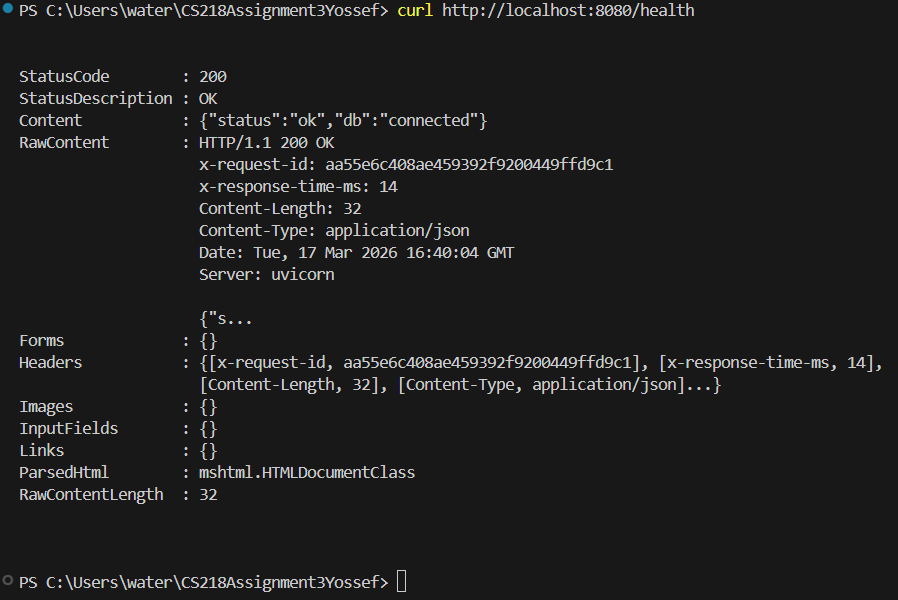
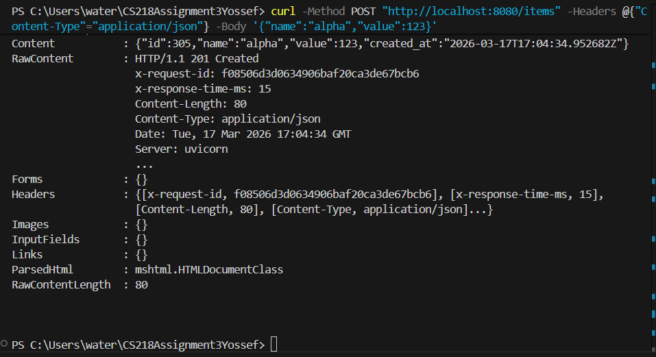
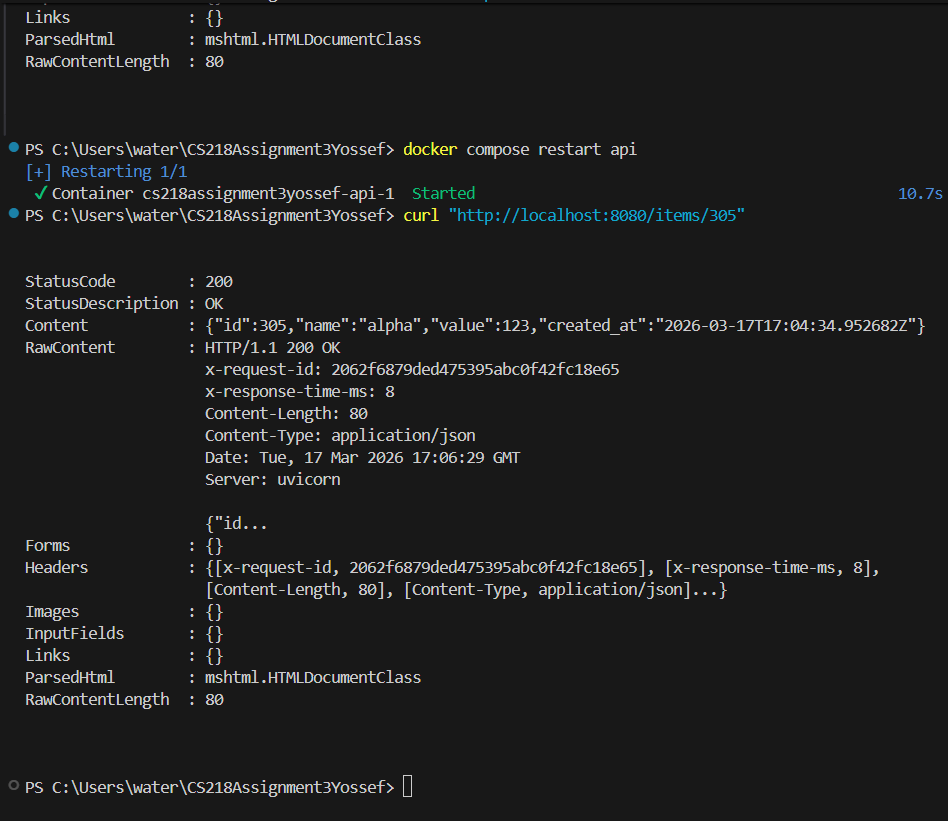
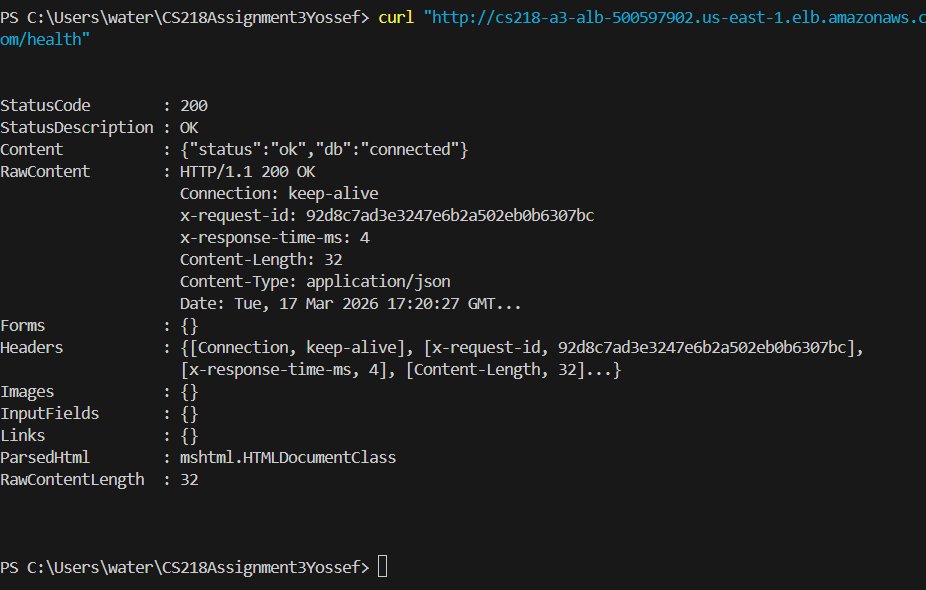
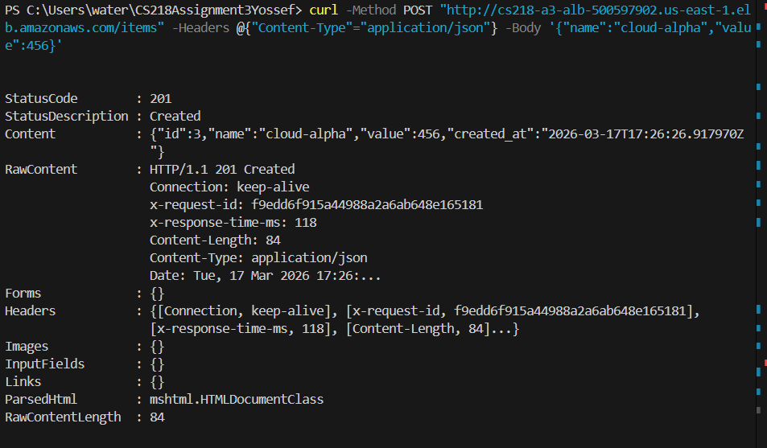
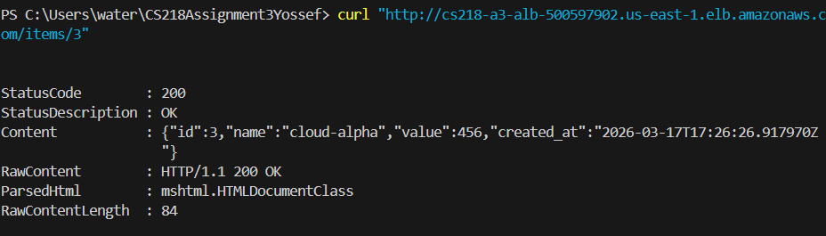
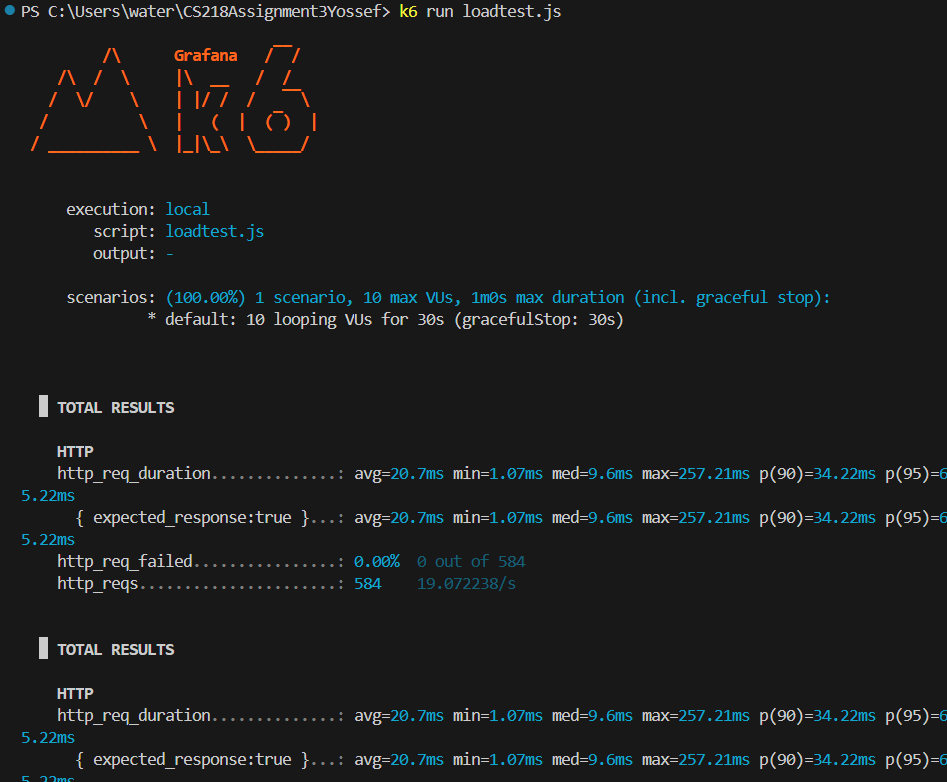

Assignment 3 Yossef

github link: https://github.com/Yossefgit/CS218Assignment3Yossef

my public ALB URL:
http://cs218-a3-alb-500597902.us-east-1.elb.amazonaws.com

local setup steps 
1 get the github file and cd into it
2 start up the docker command is:
docker compose up -d --build
(so at this point it's set up but these are the rest of the commands to make sure the test scenarios pass in the local setup)

test scenarios
before i start i just want to note that the syntax i used for some of the canvas commands were different than the canvas commands but it still completes the same thing.

1 
we check test scenario 1 which is Local Compose Boot + DB-Aware Health Check. command is:
curl http://localhost:8080/health
expected is to get HTTP 200 with DB connected status and we do get that:

2 
for text scenario 2 which is Persistence Across API Restart so we will basically create a record and it should work at creating it and after restarting the api and read the record back we should get 200 OK and the record still exists
i used this command to create an record:
curl -Method POST "http://localhost:8080/items" -Headers @{"Content-Type"="application/json"} -Body '{"name":"alpha","value":123}'
I got it created sucsessfully

i used this docker command to restart the API:
docker compose restart api
and this to read the record back the id number at the end needs to match the record we are calling which in this case is 305:
curl "http://localhost:8080/items/305"
the same record was read back

3
for Postgres Volume Persistence what is tested is that the record that we made in test scenario 2 is still there and still exists after restarting postgres. I ran
docker compose restart postgres
and than i try to read the record the id number of the end needs to match the record like in test scenario 2 so in this case it's this command again:
curl "http://localhost:8080/items/305"
4
for test scenario 4 which is AWS Health Endpoint via ALB what we should get is HTTP 200 with DB connected status after running the command below 
curl "http://cs218-a3-alb-500597902.us-east-1.elb.amazonaws.com/health"
we do get the expected output

5
for test scenario 5 which is AWS Write + Read Verification I run a POST method and a GET method to retrieve exactly what i just posted and the expected result is that POST returns id and the GET returns that same record
for the POST command this is what I ran:
PS C:\Users\water\CS218Assignment3Yossef> curl -Method POST "http://cs218-a3-alb-500597902.us-east-1.elb.amazonaws.com/items" -Headers @{"Content-Type"="application/json"} -Body '{"name":"cloud-alpha","value":456}'
and this is the result which is expected and the id is important for the GET method and in this case the id is 3

the GET command i ran was:
curl "http://cs218-a3-alb-500597902.us-east-1.elb.amazonaws.com/items/3"
it correctly returns the same record

6
for test scenario 6 which is Local Load Test (k6) I ran:
k6 run loadtest.js
I got multiple things so my image only covers the top

This is a summary of the findings:
there were 584 requests in the 30 seconds of testing
I got 0.00% failed requests so none out of the 584 requests failed
my RPS is 19.072238/s
my average latency is 20.7ms
minimum = 1.07ms
median = 9.6ms
max = 257.21ms
P90 = 34.22ms
P95 = 65.22ms